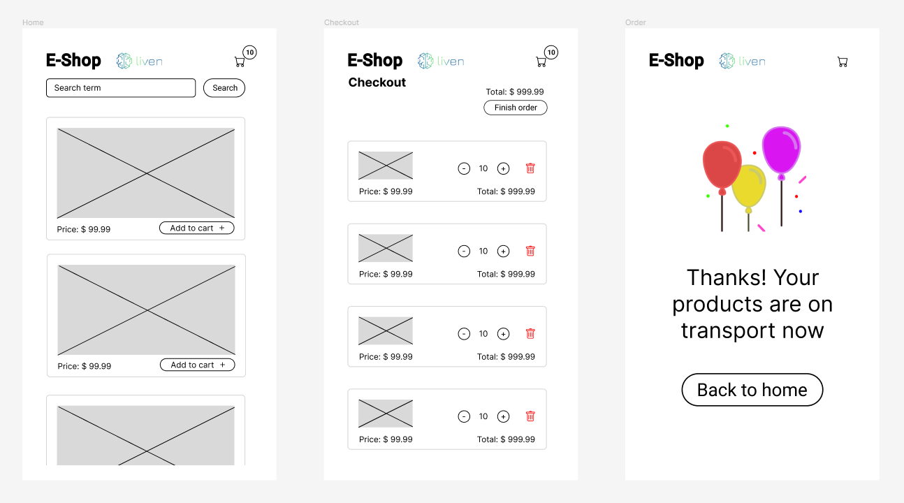

# E-commerce app made for Liven

## Deployed App on Heroku
[E-Shop Liven App](https://react-e-commerce-liven.herokuapp.com)

## Approach used:
 - Created a low fidelity prototype on figma for both mobile and desktop
 - Used icons from font awesome 
 - Consumed the fakestore API to get the products using  Axios
 - Used React router to go through the pages
 - Used Context api to hold the cart state
 - Used SASS for styling
 - Fully made with typescript and react
 - Made tests for the main components and for the golden path going through all the application

## App Screenshots samples

## Figma Screenshots from prototypes

